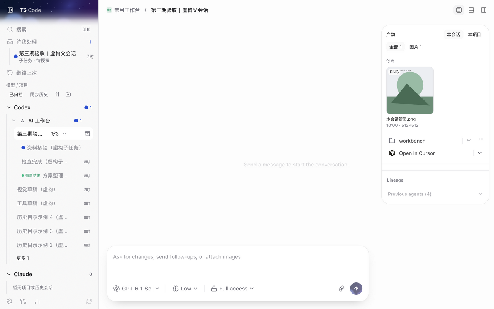
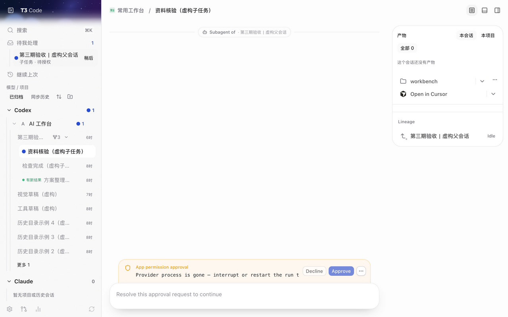
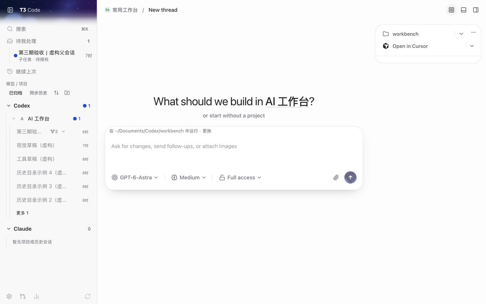
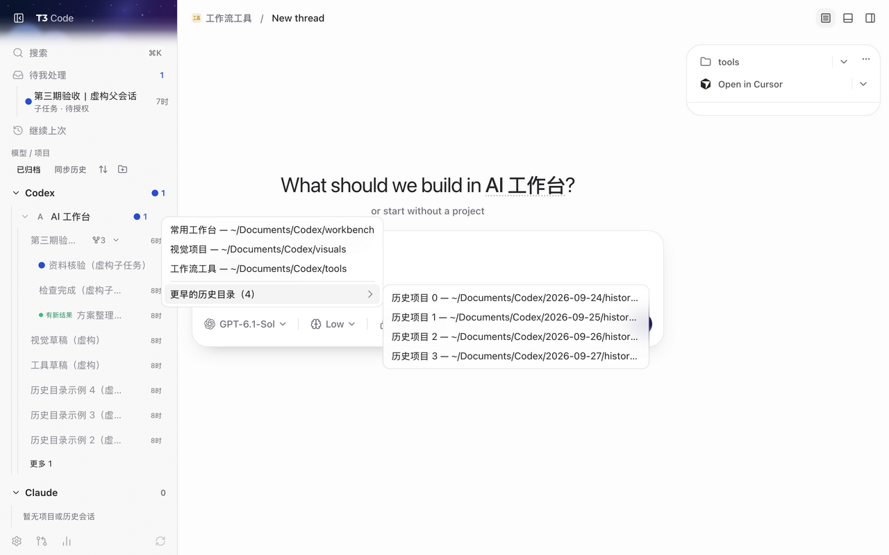
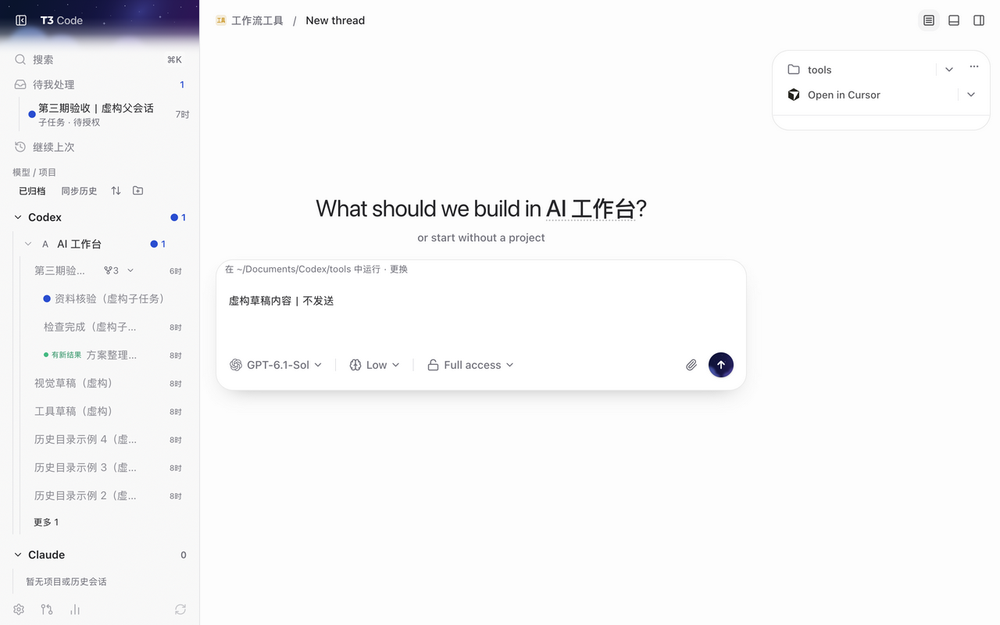

# Community fork: artifact wall and "needs me" workflow

[中文说明](README.zh-CN.md)

An unofficial, independently maintained fork of [pingdotgg/t3code](https://github.com/pingdotgg/t3code), MIT licensed like upstream. It is not affiliated with or endorsed by T3 Tools.

Base: upstream `main` at commit `9bd1d8009` (2026-10-06). All changes are one commit on the `community/artifact-wall-main` branch, so the diff against that base is easy to review.

## Why this fork exists

Upstream T3 Code is a strong control surface for agents. Its sidebar and thread view are organised around **conversations**, which fits coding work well. If you run many projects in parallel and mix code with visual or content work (images, pages, documents), three questions come up all day, and chat history answers none of them quickly:

1. **What is waiting for me right now?**
2. **What did the agents actually produce, and where is it?**
3. **Where do I continue from this result?**

This fork adds a small, connected workflow for those three questions: _find the thread that needs me → open it → look at what was produced → continue from the product_.

> All screenshots below were taken in a sandbox with **fictional data** (light theme, 1280 px wide). The UI text is currently Chinese; the logic is language-independent.

## Overview



Left to right, what you see here:

- **待我处理 (Needs me)** at the top of the sidebar: one row, because exactly one thing is waiting for a human. The second line says why: "子任务 · 待授权" (a subtask is waiting for approval).
- **A parent thread with `⑂ 3`**: its three subagent threads are folded under it and shown indented only when expanded. Each keeps its own status (blue dot = needs me, green "有新结果" = new result, plain = done).
- **产物 (Artifacts) panel** on the right: everything this thread produced, grouped by day, with filters (全部 / 图片) and a switch between "本会话" (this thread) and "本项目" (this project).

## Features

### 1. Needs me: one place for everything waiting on a human



- Collects approvals, questions, new results and failures across all projects into one sidebar entry, with per-group badges. `⌘⇧I` jumps to the next one.
- A subagent's **approval or question** still reaches you, shown with the parent's title and "子任务 · 待授权", and clicking it opens the subtask thread directly (as above, with a "Subagent of …" marker and the parent in the Lineage section).
- A subagent's **new result or failure does not** reach you. The parent model consumes those, so they would only be noise.

Upstream at the base commit has no dedicated "needs me" entry; you find waiting threads by scanning the thread list.

### 2. Subtask folding



- Subagent threads no longer appear as separate sidebar rows. The parent row shows `⑂ N`; click to expand or collapse.
- If the parent is missing (deleted, or outside the visible list), its subtasks are shown with their normal grouping, so nothing disappears.
- Archiving a parent also archives its **idle** subtasks. Running ones are skipped and the failure is shown, never silent. Un-archiving a parent does **not** auto-restore subtasks; use "恢复子任务" in the `⑂` menu.
- ⌘K search still finds subtasks.

### 3. Artifact wall


- A per-thread and per-project panel collecting **generated images, rendered pages, files written by the thread, and attachments**, with thumbnails, file name, time and size, filters, and day grouping.
- Image preview and side-by-side comparison, and **re-attach an artifact to the composer** to ask for a change. These interactions exist in the code and tests; they are **not shown in the screenshots**.
- Files that were only _mentioned_ in a thread (for example an old file whose path appears in command output) are ignored unless they were modified after the thread was created (5-minute tolerance). Attachments, rendered HTML and file changes are always kept. This avoids a wall full of old files.

Upstream at the base commit has no panel that collects the files a thread or project produced; they stay inside the chat transcript.

### 4. One-click new thread with a visible working directory





- The category's "new thread" button starts a thread **immediately** in the remembered default workspace (last used for that category; otherwise the most recently active member).
- `⌥`-click opens a short picker: recent first, `~/` paths, and `~/Documents/Codex/YYYY-MM-DD/...` folders grouped under "更早的历史目录（N）".
- Before the first message, the composer shows "在 ~/… 中运行 · 更换" (run in this directory · change), so you never start a thread in the wrong place by accident.

### 5. Sidebar grouping and history scan

- Model (Codex / Claude / …) → category → thread, both levels collapsible; recent projects at the top; an archived entry; a history sync button.
- `AgentSessionScanner` scans all time ranges including archived sessions, under a memory budget, and keeps native session identity.

## Opinionated defaults you will want to edit

- Category names and folder rules live in one file: [`apps/web/src/workspaceCollections.ts`](../../apps/web/src/workspaceCollections.ts). The defaults assume `~/Documents/<category>` folders (自媒体, 公司管理, 交易, …). Replace them with your own layout. The old behaviour is kept behind `workspaceCollections: false`.
- Automation-thread title filter: `isAutomationThread` in `apps/web/src/sidebarProviderGrouping.ts`.
- Dated-folder grouping assumes Codex's `~/Documents/Codex/YYYY-MM-DD/<name>` scratch layout.

## Build

Requires Node `^24.13.1` and pnpm `11.10.0`, same as upstream.

```bash
pnpm install --frozen-lockfile
pnpm typecheck
pnpm test        # or run the targeted suites listed below
pnpm build
```

Targeted suites for this fork: `apps/server/src/artifacts/*.test.ts`, `apps/server/src/project/AgentSessionScanner.test.ts`, and in `apps/web/src`: `artifactWall`, `workbenchInbox`, `sidebarInboxPresentation`, `sidebarSubtasks`, `projectMemberSelection`, `workspaceCollections`, `sidebarProviderGrouping`, `sidebarThreadPlacement`.

## What is and is not verified

- Verified: typecheck, the full web test suite (442 files) and the targeted server suites on top of the base commit, plus manual checks in a sandbox with fictional data, in light and dark themes at 1280 and 1024 px.
- Known upstream issues, not caused by this fork: 10 type errors in `apps/server/src/process/externalLauncher.test.ts` on `main`, and 6 failing server tests on a clean upstream checkout in the maintainer's environment (entrypoint symlink, install ownership, Antigravity paths).
- Used daily by the maintainer on macOS for a few days. **No long-term stability data**, no Windows/Linux testing, no testing against large artifact folders, remote access or multiple devices.
- The phone apps are not modified. Cloud login and passkeys are not tested with this fork.
- The desktop packaging scripts the maintainer uses are not part of this branch; build from source or package it yourself.

## Using it next to the official app

Do not point two different builds at the same data directory at the same time. If you package this fork as an app, give it its own name and data directory.

## Upstreaming

Upstream asks for a discussion before new features. If you want one of these changes upstream, open an Ideas discussion first; the artifact wall and subtask folding are the most self-contained.

Other community forks cover related ground (for example cross-project agent boards and standalone inbox clients). The "needs me" idea is a shared need, not unique to this fork; the part this fork focuses on is the **artifact-centred loop** above.

## Credits

All of T3 Code is by the T3 Tools team and contributors. This fork only adds the diff on this branch.
